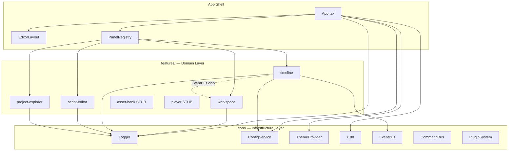

# Architecture Graph & Public APIs

> **Status**: FROZEN (Engineering Foundation Sprint)  
> **Last Updated**: 2026-07-15  
> **Owner**: Tech Lead

---

## 1. High-Level Dependency Graph (Text Format)

```
App (Shell / Layout)
 ├── core/theme          → ThemeProvider, CSS variables
 ├── core/logger         → appLogger (global)
 ├── core/plugin         → PanelRegistry (panel registration)
 ├── core/i18n           → i18next provider
 ├── core/event-bus      → EventBus (inter-feature comms)
 ├── core/config         → ConfigService (env vars)
 ├── core/command        → CommandBus (actions)
 │
 ├── features/workspace
 │    ├── components/WorkspaceHeader
 │    ├── components/WorkspaceSidebar
 │    ├── layouts/WorkspaceLayout
 │    ├── hooks/useWorkspace
 │    ├── hooks/useCurrentProject
 │    ├── hooks/useRecentProjects
 │    ├── store/workspaceStore       (Zustand)
 │    └── services/workspace.service
 │
 ├── features/timeline
 │    ├── components/TimelinePanel
 │    ├── components/TrackRenderer
 │    ├── components/ClipRenderer
 │    ├── core/engines/
 │    │    ├── PlayheadEngine
 │    │    ├── CollisionEngine      [SKELETON]
 │    │    ├── SnapEngine           [SKELETON]
 │    │    └── DragController       [TD-01]
 │    ├── core/state/timelineStore  (Zustand)
 │    ├── core/models/
 │    │    ├── TimelineDocument
 │    │    ├── TimelineTime
 │    │    ├── Clip
 │    │    └── Track
 │    ├── core/history/             [SKELETON - TD-04]
 │    ├── core/viewmodels/
 │    └── core/constants/
 │
 ├── features/script-editor
 │    ├── components/ScriptEditorPanel
 │    ├── components/SceneEditor
 │    ├── components/SceneList
 │    ├── components/StatusBar
 │    ├── store/scriptStore          (Zustand)
 │    ├── services/ScriptService
 │    ├── adapters/
 │    └── types/
 │
 ├── features/project-explorer
 │    ├── components/ProjectExplorer
 │    ├── hooks/useProjectExplorer
 │    ├── store/projectExplorerStore (Zustand)
 │    ├── services/projectExplorer.service
 │    └── types/
 │
 ├── features/asset-bank            [STUB]
 ├── features/player                [STUB]
 ├── features/ai-tools              [STUB]
 └── features/script-ide            [STUB]
```

---

## 2. Architecture Diagram (Mermaid)



---

## 3. Feature Anatomy — Detailed

### App Shell

```
src/
 ├── App.tsx              → Root: Providers, Bootstrap, Router
 ├── main.tsx             → Entry: MSW init, React mount
 └── layouts/
      └── EditorLayout.tsx → FlexLayout panel system
```

**Public API**: None (not a feature)

---

### Core Infrastructure (`src/core/`)

```
core/
 ├── config/
 │    └── ConfigService.ts   → Read VITE_* env vars safely
 ├── logger/
 │    ├── Logger.ts          → Multi-transport logger
 │    ├── ConsoleTransport.ts
 │    ├── FileTransport.ts
 │    ├── MemoryTransport.ts
 │    └── RemoteTransport.ts
 ├── theme/
 │    └── ThemeProvider.tsx  → CSS variable switching
 ├── event-bus/              → Pub/Sub for high-frequency events
 ├── command/                → CommandBus for user intent actions
 ├── i18n/                   → i18next configuration
 └── plugin/
      └── PanelRegistry.ts  → Dynamic panel registration
```

**Public API**: Imported directly by features (core is shared infra, not a feature)

---

### Feature: Workspace (`src/features/workspace/`)

```
workspace/
 ├── index.ts              ← PUBLIC API (only import from here)
 ├── components/
 │    ├── WorkspaceHeader.tsx
 │    ├── WorkspaceSidebar.tsx
 │    ├── ProjectExplorer.tsx
 │    ├── ResourceLibrary.tsx
 │    ├── ExportPanel.tsx
 │    ├── ExportProgress.tsx
 │    ├── ExportConfig.tsx
 │    ├── ExportHistory.tsx
 │    └── ExportManager.tsx
 ├── hooks/
 │    ├── useWorkspace.ts
 │    ├── useCurrentProject.ts
 │    └── useRecentProjects.ts
 ├── layouts/
 │    └── WorkspaceLayout.tsx
 ├── mock/
 ├── services/
 │    └── workspace.service.ts
 ├── store/
 │    └── workspaceStore.ts
 └── types/
```

**Public API** (`index.ts`):

```typescript
export { WorkspaceHeader, WorkspaceSidebar, WorkspaceLayout };
export { ProjectExplorer, ResourceLibrary };
export { ExportPanel, ExportProgress, ExportConfig, ExportHistory, ExportManager };
export { useWorkspace, useCurrentProject, useRecentProjects };
export { workspaceService, workspaceStore };
export type { WorkspaceState, ProjectState };
```

---

### Feature: Timeline (`src/features/timeline/`)

```
timeline/
 ├── index.ts              ← PUBLIC API (only import from here)
 ├── components/
 │    ├── TimelinePanel.tsx
 │    ├── TrackRenderer.tsx
 │    └── ClipRenderer.tsx
 ├── core/
 │    ├── constants/
 │    ├── engines/          → PlayheadEngine, CollisionEngine*, SnapEngine*
 │    ├── events/           → Timeline event types
 │    ├── factory/          → Object factories
 │    ├── history/          → HistoryManager* (skeleton)
 │    ├── input/            → DragController, InputHandlers
 │    ├── models/           → TimelineDocument, Clip, Track, TimelineTime
 │    ├── state/            → timelineStore (Zustand)
 │    └── viewmodels/       → Derived view data from models
 └── styles/
```

**Public API** (`index.ts`):

```typescript
export { TimelinePanel };
export { useTimelineStore };
export { TIMELINE_CONSTANTS };
export type { TimelineDocument, TimelineTime, Clip, Track };
```

_Items marked `*` are technical debt (skeleton implementations)._

---

### Feature: Script Editor (`src/features/script-editor/`)

```
script-editor/
 ├── index.ts              ← PUBLIC API (only import from here)
 ├── components/
 │    ├── ScriptEditorPanel.tsx
 │    ├── SceneEditor.tsx
 │    ├── SceneList.tsx
 │    └── StatusBar.tsx
 ├── adapters/             → Data transformation adapters
 ├── locales/              → i18n strings
 ├── mock/
 ├── services/
 │    └── ScriptService.ts
 ├── store/
 │    └── scriptStore.ts
 └── types/
```

**Public API** (`index.ts`):

```typescript
export { SceneEditor, ScriptEditorPanel };
export { ScriptService };
export { useScriptStore };
export type { Script, Scene, Character, DialogueInfo, ActionInfo, TransitionInfo };
```

---

### Feature: Project Explorer (`src/features/project-explorer/`)

```
project-explorer/
 ├── index.ts              ← PUBLIC API (only import from here)
 ├── components/
 │    └── ProjectExplorer.tsx
 ├── hooks/
 │    └── useProjectExplorer.ts
 ├── mock/
 ├── services/
 │    └── projectExplorer.service.ts
 ├── store/
 │    └── projectExplorerStore.ts
 └── types/
```

**Public API** (`index.ts`):

```typescript
export * from './components/ProjectExplorer';
export * from './hooks/useProjectExplorer';
export * from './store/projectExplorerStore';
export * from './services/projectExplorer.service';
export * from './types';
```

---

## 4. Public API Policy

> Any feature that wishes to use another feature MUST import **exclusively** from that feature's `index.ts`.

**Enforced by ESLint** (`eslint.config.js` — `import/no-restricted-paths`):

```
❌ FORBIDDEN:
import { TimelinePanel } from '@/features/timeline/components/TimelinePanel'
import { timelineStore } from '@/features/timeline/core/state/timelineStore'
import { PlayheadEngine } from '@/features/timeline/core/engines/PlayheadEngine'

✅ REQUIRED:
import { TimelinePanel, useTimelineStore } from '@/features/timeline'
```

---

## 5. Import Layering Rules

```
Shell (App.tsx / Layouts)
  ↓ can import from
Features (features/*/index.ts)
  ↓ can import from
Core (core/*)
  ↓ can import from
Utils / Types (utils/, types/)
```

**Cross-feature imports**: Only via `index.ts` boundaries.  
**Core → Feature imports**: **FORBIDDEN** (core must not depend on features).

---

## 6. Architecture Decision Records

| ADR                                            | Title                                 | Status      |
| ---------------------------------------------- | ------------------------------------- | ----------- |
| [ADR-0001](./adr/0001-feature-architecture.md) | Feature-Sliced Domain Architecture    | ✅ ACCEPTED |
| [ADR-0002](./adr/0002-timeline-domain.md)      | Timeline Reference Architecture       | ✅ ACCEPTED |
| [ADR-0003](./adr/0003-event-driven.md)         | Event-Driven Communication            | ✅ ACCEPTED |
| [ADR-0004](./adr/0004-runtime-state.md)        | Separation of Project & Runtime State | ✅ ACCEPTED |
